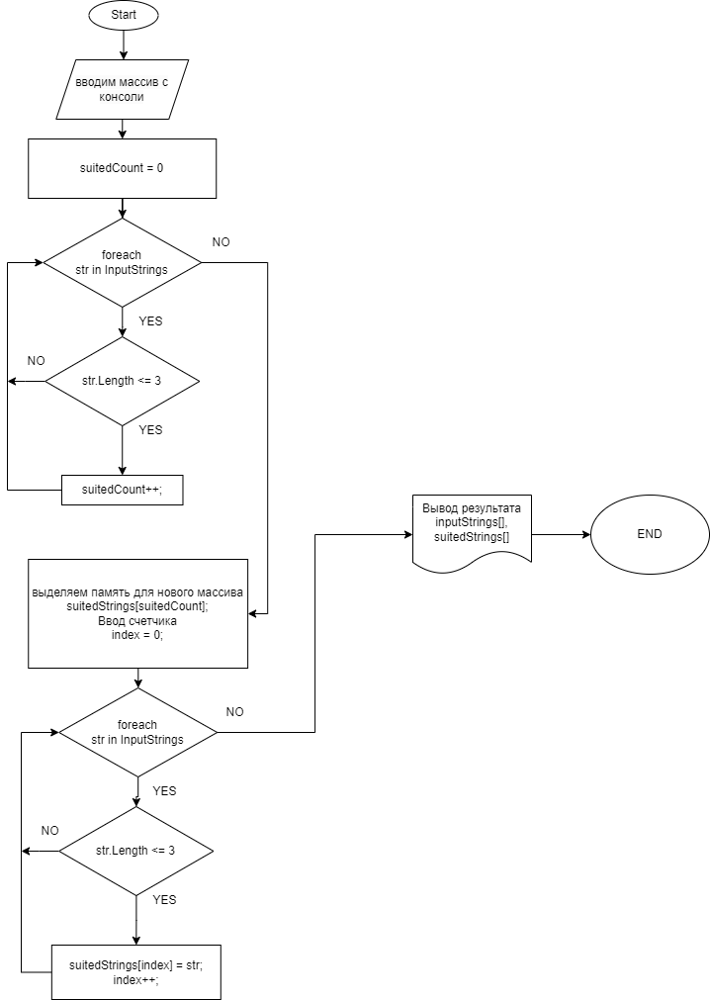

# Задача:
 Написать программу, которая из имеющегося массива строк формирует массив из строк, длина которых меньше либо равна 3 символа. Первоначальный массив можно ввести с клавиатуры, либо задать на старте выполнения алгоритма. При решении не рекомендуется пользоваться коллекциями, лучше обойтись исключительно массивами.

 ## Алгоритм решения задачи
 Используются следующие методы:

 - InputArraySize запрашивает размер строчного массива.
 - InputConsoleStrings считывает введенные строки пользователем и сохраняет их в массиве.
 - CheckingStringsSize проверяет строки, оставляет те, у которых длина массива меньше 3 символов.
 - CountSuitedStrings считает количество подходящих строк в массиве.
 - PrintArray выводит исходный и проверенный массивы на экран.

 _**Шаг 1:**_ _Запрос размера строчного массива у пользователя_

 _**Шаг 2:**_ _Ввод данных и сохранение в массиве_

 _**Шаг 3:**_ _Подсчет подходящих строк_

 _**Шаг 4:**_ _Выделение памяти для нового массива с подходящими строками_

 _**Шаг 5:**_ _Заполнение нового массива подходящими строками_

 _**Шаг 6:**_ _Вывод результатов (Исходный массив строк; Новый массив с подходящими строками)_

Блок схема:
